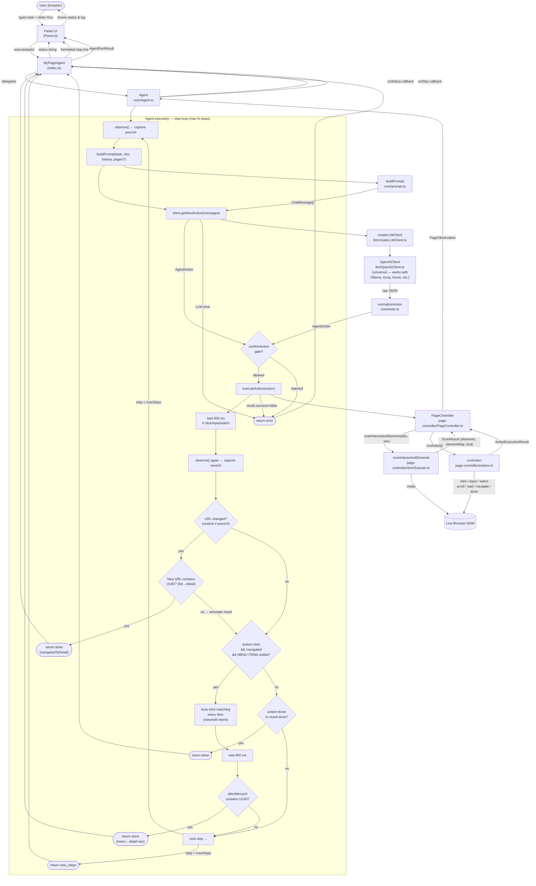
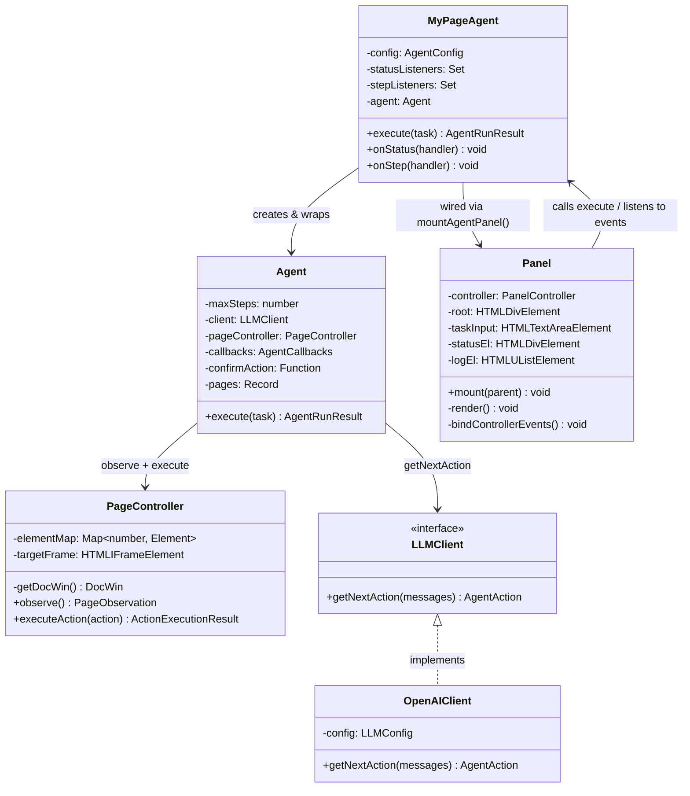
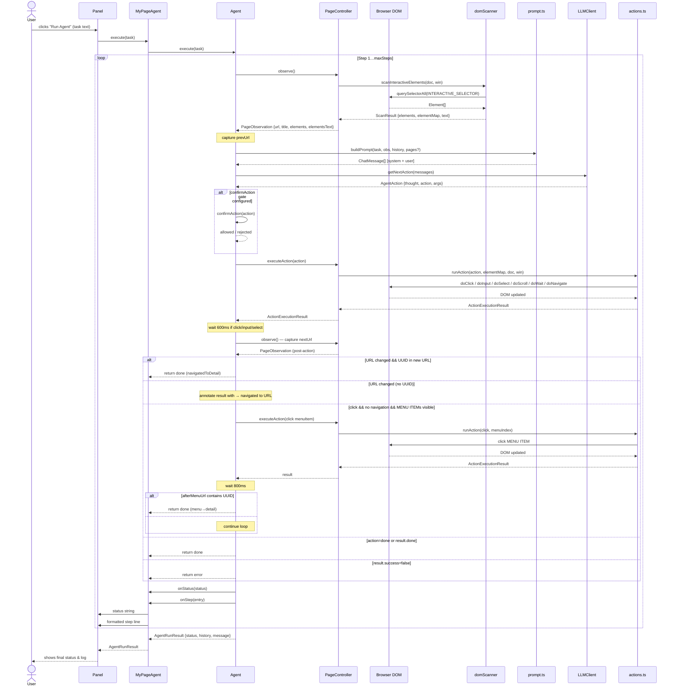
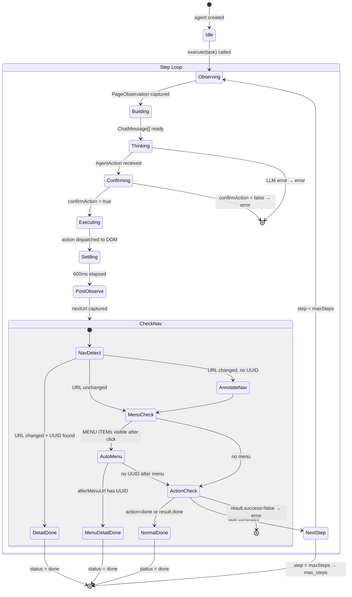
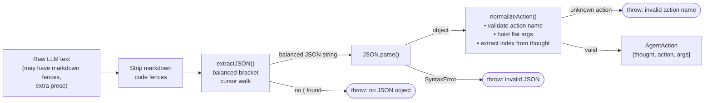

# My Page Agent — Architecture & Flow

---

## 1. Component Overview



---

## 2. Class Diagram



---

## 3. Sequence Diagram — One Agent Step



---

## 4. Agent State Machine



---

## 5. LLM Response Processing Pipeline



---

## 6. DOM Scanning & Label Resolution

```mermaid
flowchart TD
    ROOT["document / iframe.contentDocument"]
    QSA["querySelectorAll\n(button, a, input, textarea,\nselect, role=button/link/\ntextbox/combobox/menuitem/option,\n onclick , tabindex )"]
    DEDUP["deduplicate\n& filter visible"]
    PANEL["exclude\n data-agent-panel \nelements"]
    INDEX["assign 1-based indexes\nbuild elementMap"]
    LABEL["getLabel(el)\npriority chain"]

    subgraph LABEL_CHAIN ["Label priority"]
        L1["aria-label"]
        L2["title attr"]
        L3["input: label tag / placeholder"]
        L4["select: FILTER DROPDOWN: {selected}"]
        L5["combobox: FILTER DROPDOWN: {text}"]
        L6["menuitem: MENU ITEM: {text}"]
        L7["option: DROPDOWN OPTION: {text}"]
        L8["ellipsis btn: Per-item actions menu (title)"]
        L9["textContent fallback"]
        L10["tagName element"]
        L1 --> L2 --> L3 --> L4 --> L5 --> L6 --> L7 --> L8 --> L9 --> L10
    end

    TEXT["serialise to text block\n[1] button "Submit"\n[2] input:text "Search"\n…"]
    RESULT["ScanResult\n{elements, elementMap, text}"]

    ROOT --> QSA --> DEDUP --> PANEL --> INDEX --> LABEL
    LABEL --> LABEL_CHAIN
    INDEX --> TEXT
    LABEL_CHAIN --> TEXT
    TEXT --> RESULT
```
