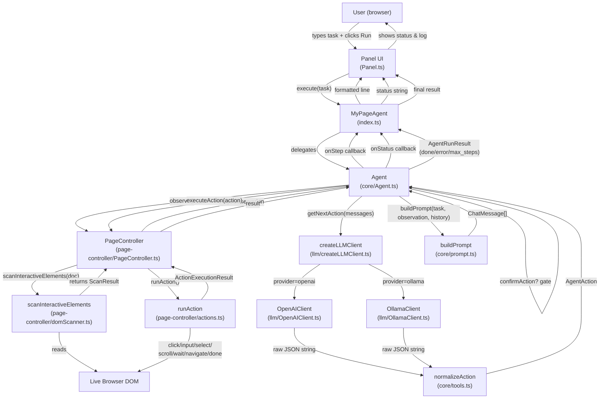

# My Page Agent — Architecture & Flow

```mermaid
graph TD
    User["User (browser)"]
    Panel["Panel UI\n(Panel.ts)"]
    MyPageAgent["MyPageAgent\n(index.ts)"]
    Agent["Agent\n(core/Agent.ts)"]
    LLMFactory["createLLMClient\n(llm/createLLMClient.ts)"]
    OpenAI["OpenAIClient\n(llm/OpenAIClient.ts)"]
    Ollama["OllamaClient\n(llm/OllamaClient.ts)"]
    PageCtrl["PageController\n(page-controller/PageController.ts)"]
    Scanner["scanInteractiveElements\n(page-controller/domScanner.ts)"]
    Actions["runAction\n(page-controller/actions.ts)"]
    PromptBuilder["buildPrompt\n(core/prompt.ts)"]
    Normalizer["normalizeAction\n(core/tools.ts)"]
    DOM["Live Browser DOM"]

    User -->|"types task + clicks Run"| Panel
    Panel -->|"execute(task)"| MyPageAgent
    MyPageAgent -->|"delegates"| Agent
    Agent -->|"observe()"| PageCtrl
    PageCtrl -->|"scanInteractiveElements(doc)"| Scanner
    Scanner -->|"reads"| DOM
    Scanner -->|"returns ScanResult"| PageCtrl
    PageCtrl -->|"PageObservation"| Agent
    Agent -->|"buildPrompt(task, observation, history)"| PromptBuilder
    PromptBuilder -->|"ChatMessage[]"| Agent
    Agent -->|"getNextAction(messages)"| LLMFactory
    LLMFactory -->|"provider=openai"| OpenAI
    LLMFactory -->|"provider=ollama"| Ollama
    OpenAI -->|"raw JSON string"| Normalizer
    Ollama -->|"raw JSON string"| Normalizer
    Normalizer -->|"AgentAction"| Agent
    Agent -->|"confirmAction? gate"| Agent
    Agent -->|"executeAction(action)"| PageCtrl
    PageCtrl -->|"runAction()"| Actions
    Actions -->|"click/input/select/\nscroll/wait/navigate/done"| DOM
    Actions -->|"ActionExecutionResult"| PageCtrl
    PageCtrl -->|"result"| Agent
    Agent -->|"onStep callback"| MyPageAgent
    MyPageAgent -->|"formatted line"| Panel
    Agent -->|"onStatus callback"| MyPageAgent
    MyPageAgent -->|"status string"| Panel
    Agent -->|"AgentRunResult\n(done/error/max_steps)"| MyPageAgent
    MyPageAgent -->|"final result"| Panel
    Panel -->|"shows status & log"| User
```
