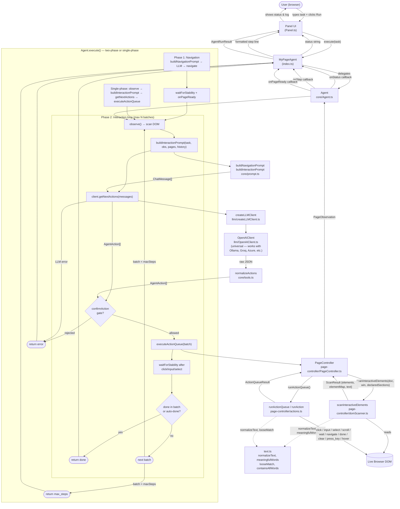
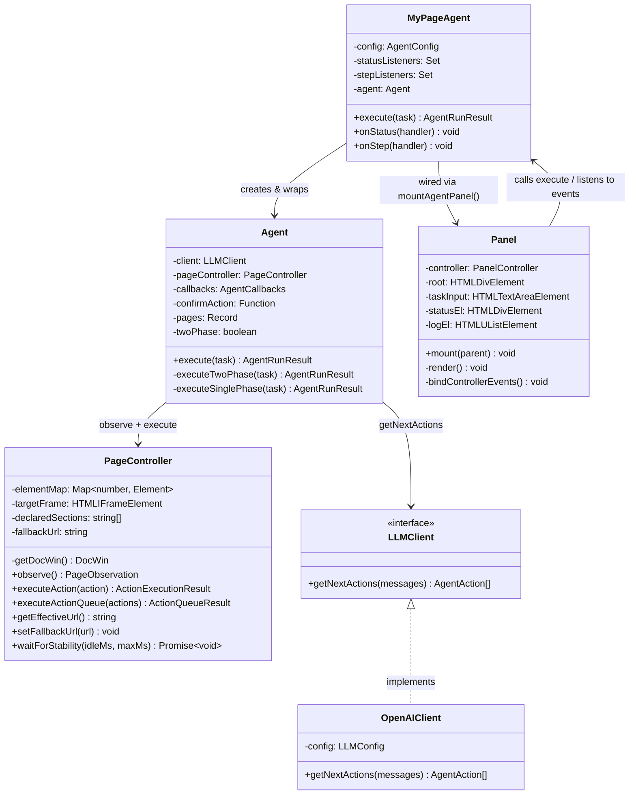
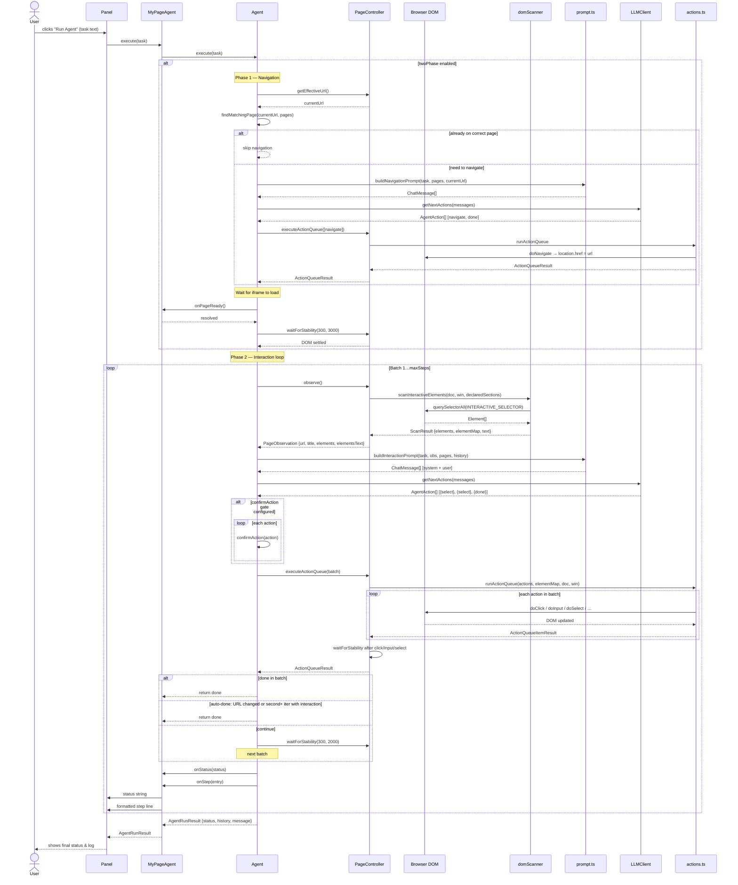
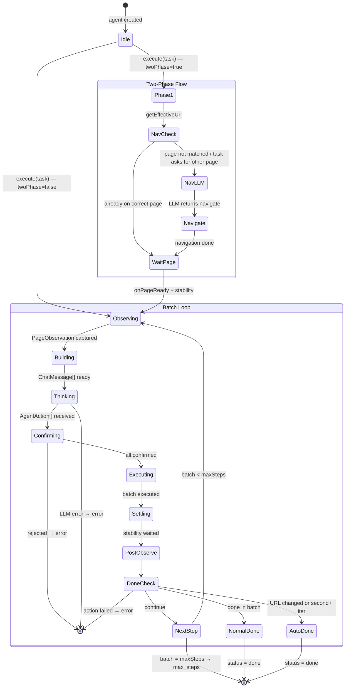
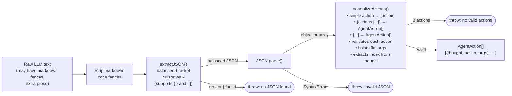
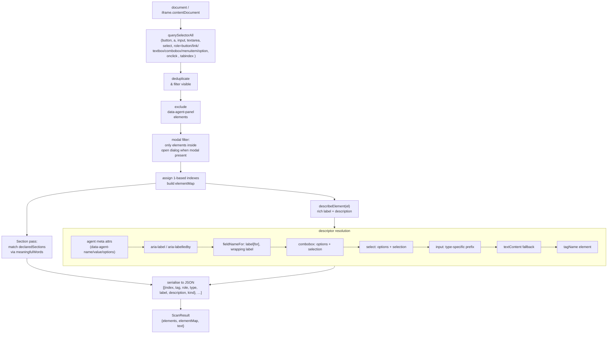
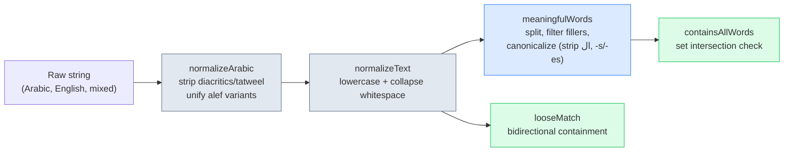
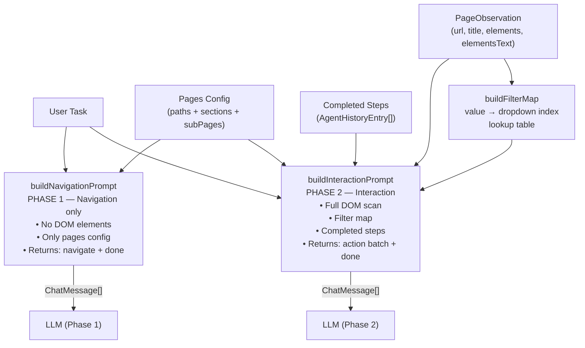

# My Page Agent — Architecture & Flow

---

## 1. Component Overview

---

## 2. Class Diagram

---

## 3. Sequence Diagram — Two-Phase Execution

---

## 4. Agent State Machine

---

## 5. LLM Response Processing Pipeline

---

## 6. DOM Scanning & Label Resolution

---

## 7. Text Normalization Layer (text.ts)

`text.ts` provides Unicode-aware (Arabic + Latin) text normalization shared by the DOM scanner (section matching), actions (option/value matching), and the intent router. It strips Arabic diacritics, unifies letter variants, filters navigation filler words, and canonicalizes plurals/articles for robust fuzzy comparison.

---

## 8. Prompt Architecture (Split)

The prompt system is now **split into two functions**:
- **`buildNavigationPrompt`** — Phase 1 only. Minimal prompt with no DOM elements; the LLM only decides which page to `navigate` to.
- **`buildInteractionPrompt`** — Phase 2 (and single-phase). Full DOM scan with filter map, completed steps, and all interaction rules.
- **`buildFilterMap`** — Helper that builds a "value → dropdown index" lookup table so the LLM doesn't need to parse JSON to find which dropdown has which option.
- `buildPrompt` is kept as a **deprecated alias** for `buildInteractionPrompt` for backward compatibility.
